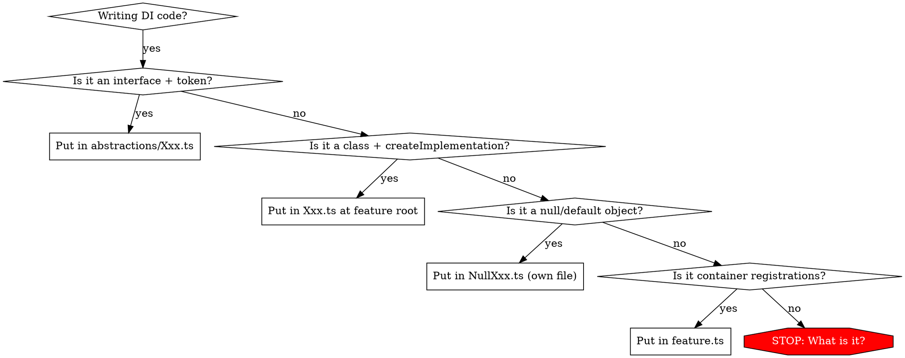

# Dependency Injection — @webiny/di Conventions

Every service lives behind an abstraction token. Implementations are classes bound to an abstraction. Consumers resolve the abstraction, never the implementation. Each concern gets its own file.

## The Iron Rule

**Every DI concern lives in its own file. No exceptions.**

| Concern                                       | File                            | Directory                             |
| --------------------------------------------- | ------------------------------- | ------------------------------------- |
| Abstraction (interface + token + namespace)   | `abstractions/XxxRepository.ts` | `abstractions/`                       |
| Implementation (class + createImplementation) | `XxxRepository.ts`              | feature root                          |
| Null/default implementation                   | `NullXxxContext.ts`             | alongside abstraction or feature root |
| Feature (createFeature + registrations)       | `feature.ts` or `XxxFeature.ts` | feature root                          |

Never combine these in one file. A file with `createAbstraction()` must not contain `createImplementation()`, a class, or `createFeature()`.



## Naming Conventions

### Class Names vs Export Names

The `Impl` suffix exists **only on the class declaration**, never on anything exported or imported.

```ts
// INSIDE the implementation file:
class PatientRepositoryImpl implements Abstraction.Interface { ... }  // Impl on class — OK

export const PatientRepository = Abstraction.createImplementation({   // NO Impl on const
    implementation: PatientRepositoryImpl,
    dependencies: [DatabaseClient]
});
```

When the same short name (`PatientRepository`) is used by both the abstraction token and the implementation const, they live in different files — the import path distinguishes them. The `as Abstraction` alias inside the implementation file resolves the local clash:

```ts
import { PatientRepository as Abstraction } from "./abstractions/PatientRepository.js";
```

### Cross-Package Implementation Exports

When another package needs to register an implementation (e.g., in tests), export with a descriptive name — never `Impl`:

```ts
// session/index.ts
export { SessionRepository as SessionRepositoryRegistration } from "./SessionRepository.js";

// In the consuming test:
import { SessionRepositoryRegistration } from "@fundus/authentication/api";
container.register(SessionRepositoryRegistration).inSingletonScope();
```

### Inner Classes in Two-Class Pattern

Repositories with domain methods use two classes. The inner class gets a `Drizzle` suffix, the outer class gets `Impl`:

```ts
class PermissionRepositoryDrizzle extends DrizzleRepository<...> { ... }  // inner — Drizzle suffix
class PermissionRepositoryImpl implements Abstraction.Interface { ... }   // outer — Impl suffix
```

### General Naming Rules

- Never abbreviate: `organizationRepository` not `orgRepo`, `authorizationService` not `authSvc`
- Never use shorthand: `Organization` not `Org`, `SuperAdmin` not `Admin`
- Constructor deps are always `private readonly` with full names
- All class methods and properties MUST have explicit access modifiers (`public`, `private`, `protected`) or use JS private `#` fields — implicit public is forbidden

## Abstraction File

**Abstractions MUST live in an `abstractions/` directory — never a flat `abstractions.ts` file.** Each abstraction gets its own file inside `abstractions/`, plus a barrel `abstractions/index.ts` that re-exports all tokens and interfaces. One file per abstraction, one `createAbstraction()` call per file.

Each file contains: interface, `createAbstraction()` call, namespace with type exports. **Nothing else — no classes, no implementations, no features.**

**Every abstraction MUST have a sibling namespace with exported types. No exceptions.** At minimum the namespace exports `Interface` (the abstraction's own interface). If the abstraction consumes external types, those are re-exported through the namespace too. An abstraction without a namespace is incomplete.

```ts
// abstractions/PatientRepository.ts
import { createAbstraction } from "@fundus/core";
import type { Where, Sort } from "@fundus/db";

export interface PatientRecord {
  id: string;
  firstName: string;
  lastName: string;
  createdAt: Date;
  updatedAt: Date;
}

interface PatientCreateInput {
  id: string;
  firstName: string;
  lastName: string;
  createdAt: Date;
  updatedAt: Date;
}

interface PatientUpdateInput {
  firstName?: string;
  lastName?: string;
  updatedAt: Date;
}

interface PatientFindOneParams {
  where?: Where<PatientRecord>;
  sort?: Sort<PatientRecord>;
}

interface PatientFindAllParams {
  where?: Where<PatientRecord>;
  sort?: Sort<PatientRecord>;
  limit?: number;
  offset?: number;
}

interface PatientCreateParams {
  data: PatientCreateInput;
}

interface PatientUpdateOneParams {
  where: Where<PatientRecord>;
  data: PatientUpdateInput;
}

interface PatientDeleteOneParams {
  where: Where<PatientRecord>;
}

interface PatientCountParams {
  where?: Where<PatientRecord>;
}

export interface IPatientRepository {
  findOne(params: PatientFindOneParams): Promise<PatientRecord | null>;
  findAll(params: PatientFindAllParams): Promise<PatientRecord[]>;
  count(params: PatientCountParams): Promise<number>;
  create(params: PatientCreateParams): Promise<PatientRecord>;
  updateOne(params: PatientUpdateOneParams): Promise<PatientRecord | null>;
  deleteOne(params: PatientDeleteOneParams): Promise<boolean>;
}

export const PatientRepository = createAbstraction<IPatientRepository>(
  "Patients/PatientRepository"
);

export namespace PatientRepository {
  export type Interface = IPatientRepository;
  export type Record = PatientRecord;
  export type CreateInput = PatientCreateInput;
  export type UpdateInput = PatientUpdateInput;
  export type FindOne = PatientFindOneParams;
  export type FindAll = PatientFindAllParams;
  export type Create = PatientCreateParams;
  export type UpdateOne = PatientUpdateOneParams;
  export type DeleteOne = PatientDeleteOneParams;
  export type Count = PatientCountParams;
}
```

**Rules:**

- Interface is `export interface` (required for tsgo strict declaration emit)
- All types accessed via namespace only (`PatientRepository.Interface`, `PatientRepository.Record`)
- Never export bare `IPatientRepository` for external consumption
- All param types use `Where<R>` and `Sort<R>` from `@fundus/db`
- Every param type gets its own named interface — never inline structural types
- No `Parameters<>`, `ReturnType<>`, or indexed access types — export explicit named types
- The namespace must contain ALL types — no top-level type exports scattered outside it
- **The namespace re-exports every type the implementation needs** — including types from other packages. Implementations import only the abstraction alias and reference types as `Abstraction.Session`, `Abstraction.Record`, etc. — never import consumed types directly from their source package

### Re-exporting External Types

When an abstraction consumes types from another package, the namespace re-exports them so implementations never import from the source directly:

```ts
// abstractions/AuthorizationRepository.ts
import { createAbstraction } from "@fundus/core";
import type { AuthorizationSession } from "@fundus/authorization";

export interface IAuthorizationRepository {
  readonly session: AuthorizationSession | null;
  setSession(session: AuthorizationSession): void;
  clearSession(): void;
}

export const AuthorizationRepository = createAbstraction<IAuthorizationRepository>(
  "Authorization/AuthorizationRepository"
);

export namespace AuthorizationRepository {
  export type Interface = IAuthorizationRepository;
  export type Session = AuthorizationSession; // re-exported from external package
}
```

The implementation then uses `Abstraction.Session` — never `import type { AuthorizationSession }`:

```ts
// AuthorizationRepository.ts
import { AuthorizationRepository as Abstraction } from "./abstractions.js";

class AuthorizationRepositoryImpl implements Abstraction.Interface {
  public session: Abstraction.Session | null = null;

  public setSession(session: Abstraction.Session): void {
    this.session = session;
  }
}
```

## Implementation File

Separate file at the feature root. Uses a local rename alias (`as Abstraction`) to avoid name clash.

### Standard CRUD (extends DrizzleRepository directly)

For repos where all methods map 1:1 to `DrizzleRepository`:

```ts
// PatientRepository.ts (at feature root, NOT in abstractions/)
import { DrizzleRepository, DatabaseClient } from "@fundus/db";
import { patients } from "./patientsSchema.js";
import { PatientRepository as Abstraction } from "./abstractions/PatientRepository.js";

class PatientRepositoryImpl
  extends DrizzleRepository<
    Abstraction.Record,
    Abstraction.CreateInput,
    Abstraction.UpdateInput,
    typeof patients
  >
  implements Abstraction.Interface
{
  public constructor(client: DatabaseClient.Interface) {
    super(client, {
      table: patients,
      primaryKey: "id",
      toRecord: row => ({
        id: row.id,
        firstName: row.firstName,
        lastName: row.lastName,
        createdAt: row.createdAt,
        updatedAt: row.updatedAt
      }),
      toInsertValues: data => ({
        id: data.id,
        firstName: data.firstName,
        lastName: data.lastName,
        createdAt: data.createdAt,
        updatedAt: data.updatedAt
      })
    });
  }
}

export const PatientRepository = Abstraction.createImplementation({
  implementation: PatientRepositoryImpl,
  dependencies: [DatabaseClient]
});
```

### Partial CRUD (two-class, return type adaptation)

When the abstraction exposes fewer methods or different return types (e.g., `deleteOne` returns `void` instead of `boolean`):

```ts
class PermissionRepositoryDrizzle extends DrizzleRepository<
    Abstraction.Record, Abstraction.CreateInput, never, typeof permissions
> {
    public constructor(client: DatabaseClient.Interface) {
        super(client, { table: permissions, primaryKey: "id", toRecord: row => ({ ... }), toInsertValues: data => ({ ... }) });
    }
}

class PermissionRepositoryImpl implements Abstraction.Interface {
    readonly #repository: PermissionRepositoryDrizzle;

    public constructor(client: DatabaseClient.Interface) {
        this.#repository = new PermissionRepositoryDrizzle(client);
    }

    public async findAll(params: Abstraction.FindAll): Promise<Abstraction.Record[]> {
        return this.#repository.findAll(params);
    }

    public async create(params: Abstraction.Create): Promise<Abstraction.Record> {
        return this.#repository.create(params);
    }

    public async deleteAll(params: Abstraction.DeleteAll): Promise<void> {
        await this.#repository.deleteAll(params);  // adapts number → void
    }
}
```

### Domain Methods (two-class with rawDb)

When the abstraction has custom query methods beyond CRUD:

```ts
class SessionRepositoryDrizzle extends DrizzleRepository<...> {
    public constructor(client: DatabaseClient.Interface) { super(client, { ... }); }

    public get rawDb(): LibSQLDatabase {
        return this.client.db as LibSQLDatabase;
    }
}

class SessionRepositoryImpl implements Abstraction.Interface {
    readonly #repository: SessionRepositoryDrizzle;

    public constructor(client: DatabaseClient.Interface) {
        this.#repository = new SessionRepositoryDrizzle(client);
    }

    // Standard ops delegate to #repository
    public async create(params: Abstraction.Create) { return this.#repository.create(params); }
    public async findOne(params: Abstraction.FindOne) { return this.#repository.findOne(params); }
    public async findAll(params: Abstraction.FindAll) { return this.#repository.findAll(params); }
    public async count(params: Abstraction.Count) { return this.#repository.count(params); }

    // Domain methods use rawDb for compound queries
    public async findByTokenHash(tokenHash: string): Promise<Abstraction.Record | null> {
        const [row] = await this.#repository.rawDb
            .select().from(sessions)
            .where(and(eq(sessions.tokenHash, tokenHash), isNull(sessions.endedAt)))
            .limit(1);
        return (row as Abstraction.Record) ?? null;
    }
}
```

**When domain methods CAN use DrizzleRepository helpers** (simple single-field equality), prefer delegation over raw queries:

```ts
// Good — delegates to DrizzleRepository
public async findByTokenHash(tokenHash: string) {
    return this.#repository.findOne({ where: { tokenHash } });
}

public async deleteByPrincipal(principalId: string) {
    await this.#repository.deleteAll({ where: { principalId } });
}

// Only use rawDb when DrizzleRepository can't express the query
// (isNull, gt, compound AND, partial field updates)
```

## Null/Default Implementations

When a service needs a fallback (e.g., unauthenticated context), the null object gets **its own file**.

```ts
// NullAuthenticatedPrincipalContext.ts (own file, NOT in the abstraction file)
import { AuthenticatedPrincipalContext } from "./AuthenticatedPrincipalContext.js";

class NullAuthenticatedPrincipalContextImpl implements AuthenticatedPrincipalContext.Interface {
  public get principal() {
    return { identifier: "", method: "session" as const };
  }
}

export const NullAuthenticatedPrincipalContext = NullAuthenticatedPrincipalContextImpl;
```

**Never** put a class in an abstraction file. If you see a class next to `createAbstraction()`, extract it immediately.

## Feature File

Container registrations live in `feature.ts`. Imports the implementation (not the abstraction) for registration. The `register()` function must be **synchronous** — async work (migrations, etc.) goes in explicit server startup functions.

```ts
// feature.ts
import type { Container } from "@webiny/di";
import { createFeature } from "@fundus/core";
import { PatientRepository } from "./PatientRepository.js"; // the createImplementation export

export const PatientsFeature = createFeature({
  name: "Patients/PatientsFeature",
  register(container: Container) {
    container.register(PatientRepository).inSingletonScope();
  }
});
```

Features compose — a larger feature can call other features in its `register`:

```ts
register(container: Container) {
    DatabaseFeature.register(container);
    PatientsFeature.register(container);
    AppointmentsFeature.register(container);
}
```

## Barrel Exports (index.ts)

Export **abstractions** (tokens + types) and **features**. Never export implementations.

```ts
// index.ts
export { PatientRepository } from "./abstractions/index.js"; // abstraction token
export { PatientsFeature } from "./feature.js"; // feature registration
// NEVER: export { PatientRepository } from "./PatientRepository.js"  // implementation
```

**Package-level exports** follow `@fundus/name`, `@fundus/name/api`, `@fundus/name/ui` — no deep paths.

## Quick Reference

| What                                          | Where                             | Exports                      |
| --------------------------------------------- | --------------------------------- | ---------------------------- |
| `createAbstraction()` + interface + namespace | `abstractions/Xxx.ts`             | Token + namespace types      |
| `createImplementation()` + class              | `Xxx.ts` at feature root          | Const (no Impl suffix)       |
| Null/default class                            | `NullXxx.ts` (own file)           | Const (no Impl suffix)       |
| `createFeature()` + registrations             | `feature.ts`                      | Feature const                |
| `index.ts` barrel                             | Feature root                      | Abstractions + features only |
| Cross-package impl export                     | `index.ts` with descriptive alias | `XxxRegistration` (no Impl)  |

## Lifetime Scopes

```ts
container.register(Impl); // Transient — new instance per resolve
container.register(Impl).inSingletonScope(); // Singleton — one instance per container
container.registerInstance(Abstraction, value); // Pre-built instance (always singleton)
container.registerFactory(Abstraction, () => v); // Lazy factory
```

**House rule:** Singletons for stateless services (repositories, clients, loggers). Transient for per-request state (contexts, handlers). Presenters injected as DI deps of other presenters must be singleton — transient causes invisible state loss.

## Dependencies

The `dependencies` array is positional — matches constructor parameters in order:

```ts
export const PatientRepository = Abstraction.createImplementation({
  implementation: PatientRepositoryImpl,
  dependencies: [DatabaseClient] // matches constructor(client: DatabaseClient.Interface)
});
```

Options: `[Dep, { optional: true }]` for optional, `[Dep, { multiple: true }]` for resolveAll.

Every constructor dep is `private readonly` with the full type from the abstraction namespace:

```ts
public constructor(
    private readonly patientRepository: PatientRepository.Interface,
    private readonly authorizationService: AuthorizationService.Interface
) {}
```

## Testing

Test doubles are **forbidden**. All tests use real implementations backed by in-memory SQLite via `createTestContainer()`. Resolve via container, never construct directly:

```ts
const client = new SQLiteDatabaseClient(":memory:");
// create tables...
const container = new Container();
container.registerInstance(DatabaseClient, client);
container.register(PatientRepositoryRegistration).inSingletonScope();
container.register(CreatePatientUseCaseRegistration).inSingletonScope();

const useCase = container.resolve(CreatePatientUseCase); // resolve abstraction
```

**Rules:**

- Never `new PatientRepositoryImpl(dep)` — always resolve through DI
- Never `vi.fn()` for repository/service mocks — use real SQLite
- Only external service interfaces (email senders, OAuth providers) may be doubled
- Build a fresh container per `describe`/`beforeEach` to avoid singleton state bleeding

## Common Mistakes

| Mistake                                          | Fix                                                              |
| ------------------------------------------------ | ---------------------------------------------------------------- |
| Class in abstraction file                        | Extract to own file (`NullXxx.ts` or `Xxx.ts`)                   |
| Feature + impl in same file                      | Split into `feature.ts` and `Xxx.ts`                             |
| Multiple concerns in one file                    | One responsibility per file — split immediately                  |
| `Impl` suffix on exported const                  | Only the class gets `Impl`; const uses short name                |
| `Impl` suffix in imports or exports              | Use `Registration` or descriptive name for cross-package         |
| Exporting implementation from index.ts           | Only export abstractions and features from barrels               |
| `import "reflect-metadata"`                      | Never — `@webiny/di` handles this internally                     |
| Bare interface export (`export interface IFoo`)  | Access via namespace: `Foo.Interface`                            |
| Inline structural types in signatures            | Extract to named interface/type in namespace                     |
| `Parameters<>` / `ReturnType<>` / indexed access | Export explicit named types in namespace                         |
| Flat `abstractions.ts` file                      | Always use `abstractions/` directory with one file per token     |
| Multiple `createAbstraction()` in one file       | Split into separate files inside `abstractions/`                 |
| Abstraction without sibling namespace            | Every abstraction MUST have a namespace (at minimum `Interface`) |
| Abbreviated variable names                       | Full names: `organizationRepository` not `orgRepo`               |
| `vi.fn()` mocks for repos/services               | Use real SQLite via test container                               |
| `new ImplClass(dep)` in tests                    | Resolve through DI container                                     |
| Async `register()` in features                   | `register()` is sync; async work in startup functions            |
